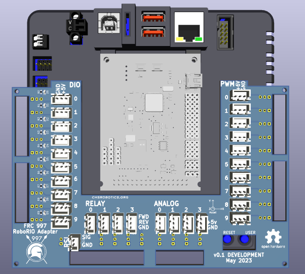

<h1>
RoboRio Adapter Board
</h1>

 Version 0.1 (Shown with NavX2 MXP)

Adapter board to bridge the RoboRio's DuPont connectors to JST-XH locking connectors.

While designed for 2.50mm JST-XH connectors, anything that can fit in 2.50mm through-holes should work. 2.54mm connectors have not been tested, but *could* work with a small amount of pin-bending.

If there's any desire whatsoever for a version using a different connector style, make an issue! We can try to make a variant for your use.

Surface-mount LEDs and resistors are completely optional. The board will function fine without them.

3d models included for mechanical fit verification in KiCad's 3d viewer can be quite performance-intensive for KiCad to open on some systems. To speed up your viewing, simply delete them.

Shared as a KiCad source project. Non-KiCad users can use the included Gerber fabrication outputs.

This is *[open source hardware!](https://www.oshwa.org/)* You're free to do what you want with it, up to and including slapping your own team logo on, or selling it as a commercial product. Just keep your version as open-source as well.

Fair warning: this is a PCB designed by an amateur, and may not meet quality standards for a commercial product yet. As of the time of writing, the first batch of fabricated boards has not yet arrived for mechanical fit checks. This repository will be updated with pictures and possible revisions when they do.
